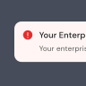

#  Banner

## Usage

Banner Alert is use to convey information or actions, can be put in a card or in modal. For example, you might show a banner that inform user there is input need to filled but not required to be specific

  

    <Banner>
      This form will be privately saved and not be shared to any 
      third parties, please filled in with correct information
    </Banner>
    
Default banners contain lower priority information and should always be dismissible, this also use to update users about a change or give them advice. Title banner is optional

  

  

    <Banner variant="danger">
      

        There’s documents need your sign that will expired tomorrow.
      

      

        <Button variant="outline" color="danger">Top Up Balance</Button>
        <Button variant="link" color="secondary">Learn More</Button>
      

    </Banner>
    
Make all banners dismissible, unless they contain critical information or an important action that users are required to take.

  

  

    <Banner variant="danger">
      

        Your enterprise Privy Balance is running out.
      

      

        Every sign will requires privy balance. Please make sure you have enough privy balance before sign the document(s)
      

      

        <Button variant="outline" color="danger">Top Up Balance</Button>
        <Button variant="link" color="secondary">Learn More</Button>
      

    </Banner>
    
Use when you want users to take an action after reading the banner.

  

##### Rules:
- Banners relevant to an entire page should be placed at the top of that page, below the page header. They should occupy the full width of the content area.
- Banners related to a section of a page (like a card or modal) should be placed inside that section, below any section heading. These banners have less spacing and a pared-back design to fit within a content context.
- Banners related to an element more specific that a section should be placed immediately above or below that element.
- Banners default can be put below content but above the actions
- Banners should focus on a single theme, piece of information, or required action to avoid overwhelming users
- Banners should be concise and scannable—users shouldn’t need to spend a lot of time figuring out what they need to know and do
- Banners should be limited to a few important calls to action with no more than one primary action
- Banners should not be used for marketing information or upsell, use callout card instead
- Banners content should be concise: keep content to 1 to 2 sentences where possible
- Banners content should clarify the benefit of the main task
- Banners content should be written in sentence case and use appropriate punctuation
- Banners content should avoid repeating the heading, but some word is still acceptable
- Banners content should explain how to resolve the issue, particularly for warning and critical banners
