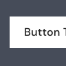

#  Button

## Usage
Buttons are used primarily for actions, such as “Add”, “Continue”, “Cancel”, or “Save”. Ghost and Link buttons, which look similar to text hyperlink, are used for less important or less commonly used actions, such as “Learn More” or “Continue Later”

## Button by type

##### Default button text

  <Button>Button Text</Button>

  Usage : Use to highlight the most important actions in any experience. Don’t use more than one default button in a section or screen.

<Badge color="gold">7K</Badge>
<Badge variant="light" color="success">999+</Badge>

##### Rules

  

    Use badges in conjunction with a single item or label, to avoid ambiguity around which item is being quantified. Suggestion: 3 digit number max, excl. the special character.
  

